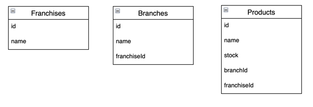

# accenture-test-challenge


### API Contract Generation

This project uses a Contract-First approach for API development, where the OpenAPI specification (api-documentation.yaml) defines all endpoints, request bodies, responses, and parameters.

The code generation is performed automatically at build time using OpenAPI Generator with the spring generator configured for Spring WebFlux (reactive=true).
The generated code includes:
•	API interfaces for controllers
•	DTOs (request and response models)
•	Standard annotations (@Valid, @RequestBody, @Schema, etc.)

### Data Model

The data model is designed in a hierarchical and embedded structure to optimize data access and management:
•	Franchise: Represents a franchise and contains a unique identifier, a name, and a list of branches.
•	Branch: Represents a branch belonging to a franchise. It contains a name and a list of offered products.
•	Product: Represents a product available in a branch. It includes the product’s name and available stock quantity.

All branch and product information is embedded within the franchise document, enabling efficient operations and fast queries in MongoDB.



### Running the Reactive Application with Docker

#### 1. Build the Project

If not already done:

```bash
./gradlew clean bootJar
```

This generates the JAR file in `build/libs/app.jar`.

#### 2. Build the Docker Image

From the root directory of the project (where the Dockerfile is located):

```bash
docker build -t accenture-test-challenge .
```

#### 3. Run the Docker Container

```bash
docker run -p 8080:8080 accenture-test-challenge
```

Your application will now be available at:

```
http://localhost:8080
```
